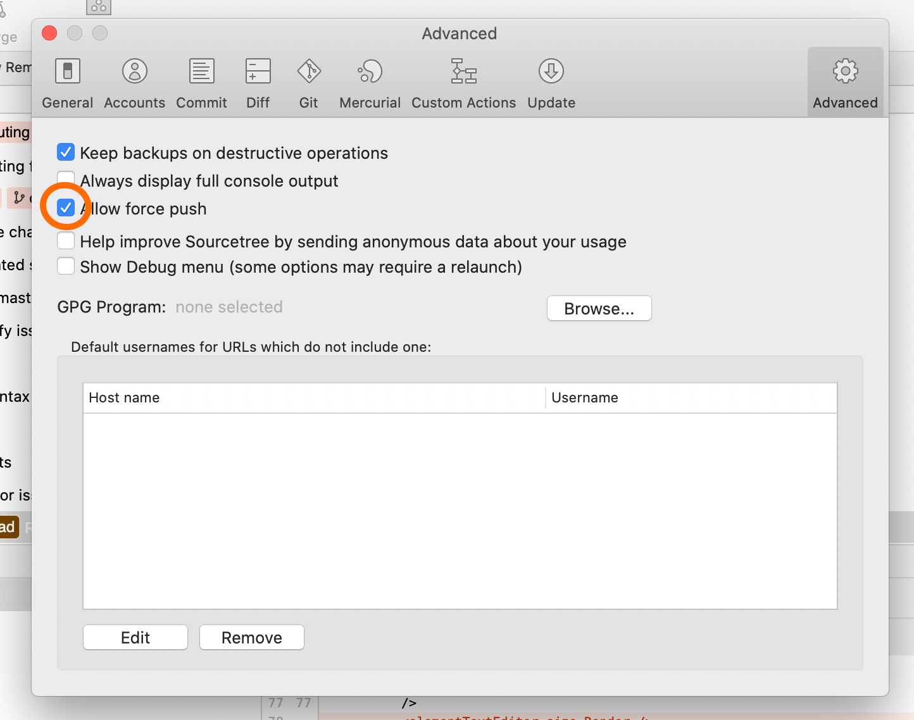
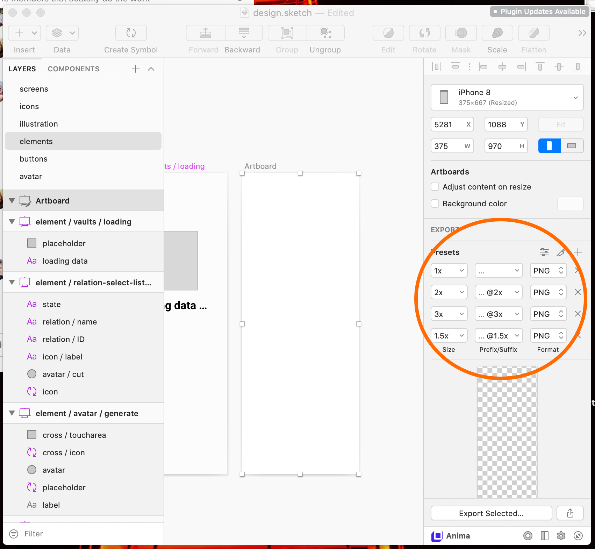

# Consento Mobile - Development and Contributor Guide

## Prerequisites to contribute to code

- Get a Git client (we recommend [Sourcetree](https://www.sourcetreeapp.com/))
- Enable `allow force push` in the `SourceTree` > `Preferences` > `Advanced` 

    

    _Using force-push can have unexpected consequences but it is a crucial tool when working with big design files to keep the git repository of a reasonable size, also it allows to clean a messy branch before showing it to other people_

- Make sure you have [Node.js](https://nodejs.org/en/download/) - version 10 or newer

    - ... you can check in a terminal by running `node -v`
    - ... on mac you may need to open the packager with `right-click` > `open`
    - ... If you use the installer, consider [setting the global npm directory](https://github.com/mixonic/docs.npmjs.com/blob/master/content/getting-started/fixing-npm-permissions.md#option-2-change-npms-default-directory-to-another-directory)

- Make sure you have the latest npm installed. `npm install npm@latest -g`
- _(If you want to work on the design:_ [Sketch](https://www.sketch.com/) _(Note: you can work on the design without Sketch, but its a bit harder))_

    - ... add [Expo-export plugin] for Sketch (https://github.com/consento-org/expo-export/releases) Make sure your Sketch plugins are up to date.

- _(as well as Code editor - [VSCode](https://code.visualstudio.com/) to work on code, recommended)_

    - ... add [eslint plugin](https://marketplace.visualstudio.com/items?itemName=dbaeumer.vscode-eslint) for VSCode

- Make sure you have a mobile phone with Expo installed [App Store](https://apps.apple.com/us/app/expo-client/id982107779) or [Play Store](https://play.google.com/store/apps/details?id=host.exp.exponent&hl=en)
- And an expo account for notifications to work ([sign up](https://expo.io/signup))


## Getting started

0. _You need to run it in the correct folder. `cd ...`_
1. Make sure you have the [mobile app](https://github.com/consento-org/mobile) git repository cloned on your computer
2. Open the folder of the local copy in a Terminal - _(VSCode if you have it or a terminal app)_ 
3. Run `npm install` **this may take 2~3mins**
4. Run `npx expo login` - to login with your expo account - important for getting notification tokens.
5. Run `npm start` to start the development process
6. _(IPhone only):_ Open the camera and scan the QR code
7. _(Android only):_ Open the expo app and scan the QR code


## General Workflow

- Make sure you work in your own branch.
- To reload the mobile app you have three options:

    1. Shake your device until a restart dialog shows.
    2. Close the mobile app and start again from expo home screen.
    3. If your mobile phone is an Android phone and is connected to your computer, you can run `npm run android:reload` to reload your app.
    4. On modern Android version a permanent notification is shown when the app is open, with a reload button.

- Work on git branches! Preferably create small branches from the master branch and commit your changes often, using Sourcetree.
- Push your new branches to github and create Pull Requests with the changes.


## Pull request

When you send a GitHub Pull Request to consento, please write with a clear list of what you've done, and attribute to co-authors if any. Make sure all of your commits are atomic (one feature per commit). Please follow our coding conventions (below).

Always write a clear log message for your commits. One-line messages are fine for small changes, but bigger changes should look like this:

```shell
$ git commit -m "A brief summary of the commit
>
> A paragraph describing what changed and its impact."
```


## Coding conventions

Start reading our code and you'll get the hang of it. We optimize for readability:

- Even though the tests are sparse, this project has linting and tests setup. Please configure your editor and run the tests before sending a pull request.
- We try to keep commits small (particularly with assets), for that, please squash commits before merging pull-requests.
- We are eager to improve the code quality even with smaller measures, if you see a means to improve the quality, we welcome a PR that might turn into policy.

## Update Workflow

When you get a new version Consento

- If the `package.json` file changed...

    - ... stop any previously called `npm start` commands
    - ... run `npm install` with the terminal in the folder of the local copy
    - ... run `npm start` again

- In any case: new changes from master might break the data stored on your mobile device! Use the reset dialog to delete data in that case. 

## Code Workflow

- The `src/style/component` folder is the biggest source for design settings. Edits in this folder are OK. Specially if you don't have sketch installed) but before the changes can be merged they need to be merged by hand in the sketch file (to prevent future edit conflicts.
- The `src/Assets.tsx` and `src/styles/Component.tsx` file are generated through expo-export ([here](https://github.com/consento-org/expo-export/blob/be067e387d42aedc3e3e738ef6dce4a3c6ed5e0a/src/generate/components.ts#L462) and [here](https://github.com/consento-org/expo-export/blob/be067e387d42aedc3e3e738ef6dce4a3c6ed5e0a/src/generate/assets.ts#L112)). If you need to change something in those or other files generated by expo-export you may need to also update the plugin itself to prevent future edits.

## Design Workflow

Open the `./design/design.sketch` in Sketch.

Layer names will correspond to the exported file/variable names. Layers or artboards which names begin with `#` will be ignored in the export.

If you notice an element that exists in the app but not in the sketch file it means that element was added by hand. If you have the time please add the element in Sketch and send a Pull Request asking to connect some UI to it.

- `export all` will execute all processes but because it takes a while, you can run partial processes for a quicker export.
- `export components` will export all information related to position & text.
- `export assets` will export all artboards with _"export"_ presets. (see next section).
- `export textstyles` will export all **named** textstyles. - use it if you added/changed a common text style.
- `export fonts` will export new fonts. Only use if we change the whole new system font. The new font needs to be added to [the fonts folder](https://github.com/consento-org/mobile/tree/master/assets/fonts) by hand!
- `export color` will export all named colors (in the color palette).

*note: don't use `name` (or `backgroundColor`, `width`, `height`, `Render`, `Text`, `Image`, `Slice9`) when you name arboarts, because it will conflict with internal variables. [ISSUE#2](https://github.com/consento-org/expo-export/issues/2)*

After the export you should see updates in the `/styles/` folder. (also visible in Sourcetree)

[IMG]

Changes in your `.sketch files` **will cause GIT conflicts**. But don't worry: **THIS IS OKAY!** We have the changes also in text form and that makes it relatively easy to manually merge conflicting files. It's on us.

### Assets

To add an asset, simply create a new artboard in the Sketch file.


Make it exportable and specify the export preset settings.


We use the export sizes: `1x`, `2x`, `3x` and `1.5x`.



To make it more convenient for you, you can specify a default preset in Sketch that is applied every time you make an artboart exportable.

Don't forget to run `export assets` after you created or updated an asset.

### Debugging expo-export

1. Install the [sketch dev tools](https://github.com/skpm/sketch-dev-tools/releases/tag/v0.9.9) plugin
2. Open the Plugin > Dev Tools 
3. See an output log on every consento command.

## Code of conduct

We are open to discussions and divergence of points of view. Specially on how to resolve tech challenges or find new features to solve usability issues.
However, as for consento project, the consento team will remain in charge when it comes to merge, deploy or promotions of the technology.

We are committed to do some good tech that can be of valuable use for users and coders.

## Screenshots

For publishing Consento on app stores, we have added a system to take screenshots of the app as its running. The system requires user interaction and
because of that it is a manual task to update the screenshots. **Before a release it is a good idea to update the screenshots.**

_Preparations:_

- You need two devices. Preferably the main device being an android device with a 1080 × 2340 screen resolution, to maintain the size.
- The main device needs to be reset _(you can do that in the config screen, pressing reset twice)_.
- Stop any other expo processes that you may have started.
- Print the `./screenshot/fake-top-secret-document.pdf` which will be needed to take screenshots for the image editor.

Once you are ready, you need run following command in the CLI. `$ npm run screenshot -- --clear` and start the application on your main device.

After the application has started, the command line will let you know what to do next. Something like:

```
[17:05:13] Screenshot vaultsFull taken. 34 Missing Screenshots. Next: → config
[17:05:13]       Open the config screen with the top-left consento icon.
```

**NOTES**:

- The first device that you start will be used as the main device to take screenshots.
- During the process you should not interact with the app too quickly. Taking the screenshots during animations may result in mid-animation screenshots.
- Occasionally screenshots may not be properly transfered to your computer. An error will be shown in the CLI like
    `Error: Didnt receive whole file vaultsFull.png,  83782 !== 85210. You need to try again.`. You should be able to re-record the screenshot most
    times again by re-navigating to that particular screen. (or reloading the app)
- The `--clear` flag added in the startup will delete previous screenshots. If you want the previous screenshots to not be overwritten, start it
    without that flag: `$ npm run screenshot`

### Social contact

- Keybase chat: https://keybase.io/team/consento
- Questions, mail to: [keepsafe@consento.org](mailto:keepsafe@consento.org) or as [issue](https://github.com/consento-org/mobile/issues/new)
