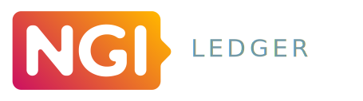

  
  <h3 align="center">The Consento Mobile App</h3>
  

An app to handle your confidential data through people you trust.

- [📚 Read a user guide](https://docs.google.com/viewer?url=https://raw.githubusercontent.com/consento-org/mobile/master/docs/overview.pdf)
- [🎥 See a video ](https://vimeo.com/387456151)
- [📱 Install it now](https://expo.io/@consento/consento)

## Our Mission
Our identities and confidential information turn digital. The challenge is to make sure that everyone remains in full control over their personally identifiable information.

A new digital society should not be one where people have to adapt to technology, but where our digital lives can be handled the same way as we learned to do in real life.
We believe encrypted data management can be redesigned with human trust at its core.

## Current state

With funding from the [NGI](https://www.ngi.eu/news/2019/06/05/ledger-selects-16-human-centric-projects-working-on-decentralised-technologies-to-enter-its-venture-builder-programme/) we were able to build a MVP, which we now want to try with as many people as possible to make [Consento](https://consento.org/about/) grow.

Watch this repository to get updates on our progress.

## Get in touch 

Usually we communicate about Consento on our [Keybase chat](https://keybase.io/team/consento). Feel free to join our public channel and ask us any questions that come to mind. You can also send us questions to keepsafe@consento.org

You can also find more detailed information about Consento on our website: [https://consento.org](https://consento.org).

## License

[MIT](./LICENSE)

## Credits

This project has received funding from the European Union’s Horizon 2020 research and innovation programme within the framework of the LEDGER Project funded under grant agreement No825268.

